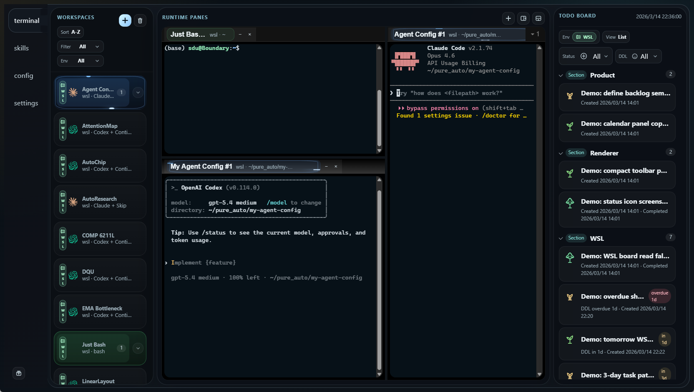

<p align="center">
  <h1>Agent Watchboard</h1>
  <p>Desktop watchboard for orchestrating multiple code agents across persistent terminal workspaces, shared task boards, and reconnectable runtime panes.</p>
</p>

<p align="center">
  
  
  
  
</p>

<p align="center">
  
</p>

## Overview

Agent Watchboard is a desktop control surface for people who run more than one coding agent at the same time and need the runtime state to stay visible.

It combines three layers in one application:

- persistent workspace templates for Codex, Claude Code, bash, and custom terminal profiles
- a split-pane runtime workbench with reconnectable PTY sessions
- a shared Todo Board that stays in sync with the repo-local `todo_preview` CLI and skill

The current real-world target is Windows with WSL, where host-side and WSL-side tools need to coexist without forcing the user to mentally switch between two different environments.

## Platform Support

- Windows
- Windows + WSL
- Linux

Windows + WSL is the setup that has been exercised most heavily in day-to-day usage.

## Supported Agents

- Codex
- Claude Code
- plain shell / bash profiles
- custom terminal profiles built from saved workspace templates

## Why This Exists

Typical agent tooling still treats each terminal as an isolated session. That breaks down when you want to:

- keep multiple agents open across different repos and environments
- reconnect after closing the UI
- switch between host and WSL paths without losing context
- track shared tasks in a board that both the desktop UI and CLI can mutate
- understand which agent is ready, working, stalled, or stopped

Agent Watchboard is designed as the missing operational layer above individual agent CLIs.

## Core Capabilities

- Save workspace templates and launch them into tabs, splits, or background runtime instances.
- Reconnect to live PTY sessions after restarting the desktop UI instead of discarding terminal state.
- Run host and WSL workspaces side by side in a single watchboard.
- Inspect skills, configs, and runtime state from the same application shell.
- Share a JSON Todo Board between the desktop app and terminal automation through `todo_preview`.
- Persist workbench layout, workspace definitions, settings, and runtime diagnostics outside the repository.

## Development Priorities

These are the two product directions the project is being shaped around:

### 1. Seamless Multi-Environment Operation

The long-term goal is to make agent execution feel continuous across:

- host
- WSL
- server / remote runtime targets

Today the app already supports host and WSL workflows. The next step is to extend the same visual language, runtime health model, and path-aware tooling into remote or server-backed agent environments without forcing separate UIs.

### 2. Multi-Agent Monitoring And Sync

The watchboard is meant to become a single surface for supervising several agents at once:

- unified session state and health visibility
- synchronized task tracking through the board + CLI bridge
- consistent workspace identity across Codex and Claude Code
- better operational insight into which agent is running, idle, blocked, or producing output

## Quick Start

```bash
pnpm install
pnpm dev
```

## Build

```bash
pnpm build
pnpm dist:linux
pnpm dist:win
pnpm dist:win:portable
```

Notes:

- Linux packages are written under `release/` as `AppImage`.
- `pnpm dist:win` writes a runnable `release/win-unpacked/` folder that is useful for Windows-side testing from a non-Windows host.
- `pnpm dist:win:portable` produces a Windows portable `.exe` when the host environment has the required Windows packaging tooling such as `wine`.

## CLI

```bash
pnpm todo_preview list
pnpm todo_preview add "new task" --topic Inbox
pnpm watchboard --help
```

## `todo_preview` Skill Setup

`todo_preview` is the shared task-management surface for this project. The desktop board UI and the CLI both read and write the same JSON board file, so agents can update tasks from the terminal while the app reflects the changes immediately.

If you want your agent runtime to invoke the skill directly, expose this repository skill in the agent's skill search path:

- Codex: make sure [`skills/todo_preview/SKILL.md`](skills/todo_preview/SKILL.md) is visible from your Codex skills directory, usually by copying or symlinking this repository `skills/` folder into `~/.codex/skills/`.
- Claude: expose the same repository `skills/` folder in the Claude-side skill location you use for local skills.
- Repository-local fallback: even without global skill installation, you can always run the CLI directly with `pnpm todo_preview ...` from this repository.

The default board path is `~/.agent-watchboard/board.json`. Keep the desktop app and CLI pointed at the same file if you want one shared board view. Override the path when needed:

```bash
pnpm todo_preview --file ~/.agent-watchboard/board.json list
```

## Common `todo_preview` Workflows

List the current board:

```bash
pnpm todo_preview list
```

Add a task into a topic:

```bash
pnpm todo_preview add "Investigate CI failure" --topic Inbox
```

Add a task with more detail and a deadline:

```bash
pnpm todo_preview add "Release v0.5.2" --topic Release --description "Push tag after CI passes" --ddl 2026-03-13
```

Mark a task as in progress or done:

```bash
pnpm todo_preview doing "Investigate CI failure"
pnpm todo_preview done "Investigate CI failure"
```

Move a finished task back to `todo`:

```bash
pnpm todo_preview todo "Investigate CI failure"
```

Rename a task and update metadata:

```bash
pnpm todo_preview update "Release v0.5.2" "Publish v0.5.2" --description "Close release issue after green CI" --ddl 2026-03-13
```

Set or clear a deadline:

```bash
pnpm todo_preview ddl "Publish v0.5.2" 2026-03-14
pnpm todo_preview ddl "Publish v0.5.2" --clear
```

Move a task into another topic:

```bash
pnpm todo_preview move "Publish v0.5.2" Release
```

Rename or reorganize topics:

```bash
pnpm todo_preview rename-topic Inbox Triage
```

Remove an obsolete task or section:

```bash
pnpm todo_preview remove "Old follow-up"
```

Import an older Markdown checklist one time into the JSON board:

```bash
pnpm todo_preview migrate-markdown ./legacy-todo.md
```

## Runtime Data And Logs

The app persists runtime data outside the repository:

- Windows: `%APPDATA%/agent-watchboard/`
- Linux: `~/.config/agent-watchboard/`

Shared todo board default path:

- Host / Linux: `~/.agent-watchboard/board.json`
- Windows app default: WSL-side `~/.agent-watchboard/board.json`

Important runtime files:

- `workspaces.json`
- `workbench.json`
- `settings.json`
- `supervisor-state.json`
- `logs/main.log`
- `logs/supervisor.log`
- `logs/sessions/<workspaceId>/<terminalId>.log`
